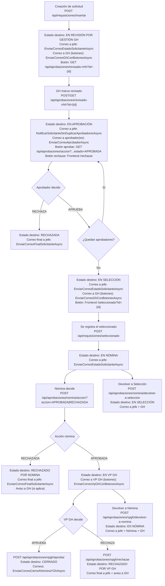

# Flujo de envío de correos – BackendRequisicionPersonal

> Nota: por decisión del proyecto, el destinatario "solicitante" que se notifica por correo **se obtiene desde `CorreoJefe`** (no desde `SolicitanteCorreo`).

## Nota importante (VP GH botones)
El flujo correcto de VP GH es usar endpoints dedicados (`/api/aprobaciones/vpgh/aprobar` y `/api/aprobaciones/vpgh/rechazar`).
Si algún correo/botón usa `/api/aprobaciones/accion?estado=APROBADO POR VP GH`, debe ajustarse para evitar 404/validaciones.
